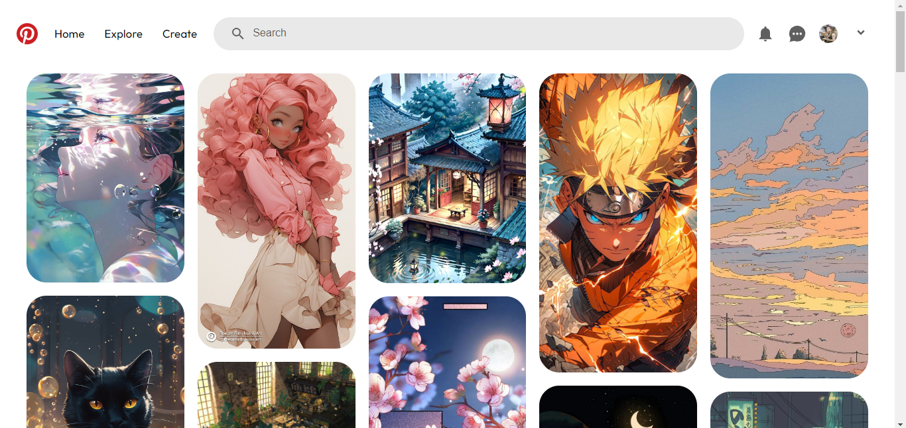

# Pinterest UI Clone using HTML and CSS

## Description

This project is a clone of the Pinterest user interface created using HTML and CSS. It replicates the core features of Pinterest's layout, including the navigation bar, search bar, and image grid. The project demonstrates responsive design and interactive elements, making it a showcase of front-end development skills.

## Table of Contents

- [My Process](#my-process)
- [Built With](#built-with)
- [What I Learned](#what-i-learned)
- [Preview](#preview)
- [Live Demo](#live-demo)

## My Process

I started by structuring the HTML to represent the Pinterest layout, including the navigation bar, search bar, and image grid. I then utilized CSS to style the components, applying colors, fonts, and responsive design techniques.

## Built With

- HTML
- CSS

## What I Learned

Through the process of creating this Pinterest UI clone, I gained practical knowledge in several areas:

- **HTML Structure:** I improved my ability to structure a webpage using HTML elements and semantic tags to represent different sections of the Pinterest interface.

- **CSS Styling:** I refined my skills in using CSS to style various components, including the navigation bar, search bar, and image grid. This included customizing colors, fonts, and spacing.

- **Flexbox Layout:** I utilized CSS flexbox to create responsive and flexible layouts, aligning elements both horizontally and vertically within the image grid.

- **Responsive Design:** I learned how to make the interface responsive by adjusting styles for different screen sizes. This ensured that the layout maintains its functionality and aesthetics on various devices.

- **Interactive Elements:** I added interactive elements, such as hover effects on images and navigation items. This enhanced user experience and provided visual feedback.

- **Sticky Header:** I implemented a sticky header using CSS to keep the navigation bar at the top of the page as the user scrolls.

- **CSS Variables:** I leveraged CSS variables to maintain consistency in colors and sizes throughout the project. This practice improved code readability and ease of maintenance.

## Preview

## Live Demo

Explore the live demo of the Pinterest UI Clone [here](https://aachal01.github.io/pinterest-ui-clone/).

